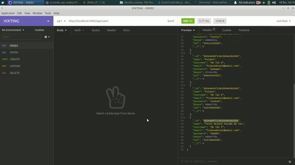
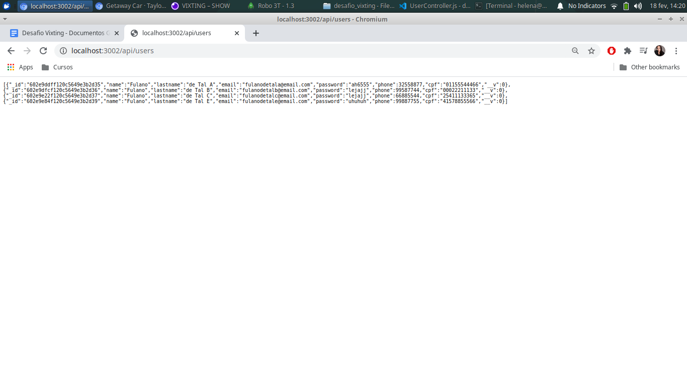

#  Desafio Técnico Vixting 

## Descrição
Desenvolvimento de projeto fullstack onde o backend foi construído utilizando Node.js, Express, Nodemon, Javascript, MongoDB e Insomnia.


## Índice
- [Requisitos](#Requisitos)
- [Instalação](#Instalação)
- [Uso](#Uso)
- [Imagens](#Imagens)


## Requisitos
- Siga os passos de instalação abaixo. 

## Instalação
- Utilizar o comando
  - No terminal, utilizar o comando: 

  ``` 
  npm install 
  ```
Obs: Ele é responsável por instalar todas as dependências de desenvolvimento utilizadas no projeto. Elas serão responsáveis pelo seu funcionamento correto. 

```
npm install express
```


## Uso
Para rodar a aplicação:
- No terminal, utilize o comando:
```
node server.js
```

Ele é responsável por fazer a conexão com o banco de dados;

No navegador, colocar o endereço: `http://localhost:3002/api/users` onde será possível acompanhar o CRUD da aplicação (ou fazendo o uso das interfaces Postman ou Insomnia)

```
npm install -D nodemon
```

Responsável por atualizar o servidor automaticamente (evita que a gente adicione um produto e desligue e ligue o servidor novamente)

```
npm run dev
```

Esse é o nome do script criado no package.json

---

## Imagens

- Visualização de todos os usuários utilizando o insomnia (GET / INDEX)

<p align="center">
  
</p>

- Visualização de um usuário por vez de acordo com seu ID utilizando o insomnia (GET / SHOW)

<p align="center">
  
</p>

- Criação de um usuário utilizando o insomnia (POST / CREATE)

<p align="center">
  
</p>

- Atualizaçao de um usuário por vez de acordo com seu ID utilizando o insomnia (PUT / UPDATE)

<p align="center">
  
</p>

- Deletando um usuário por vez de acordo com seu ID utilizando o insomnia (DEL / DELETE)

<p align="center">
  
</p>


- Visualização da persistência dos dados utilizando o Robo3t 
<p align="center">
  
</p>


- Visualização dos usuarios criados utilizando o caminho dos dados utilizando http://localhost:3002/api/users
<p align="center">
  
</p>
